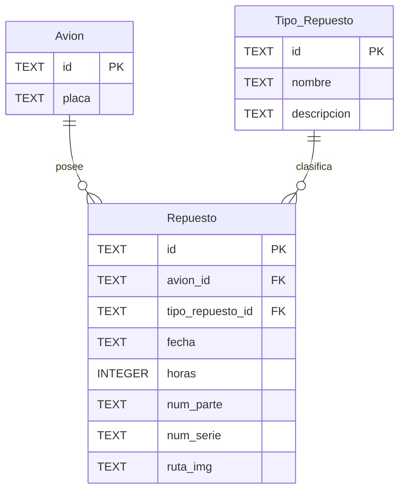
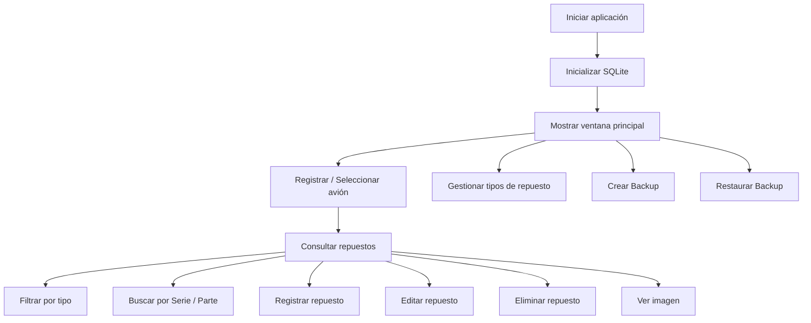

# ✈️ Repuestos App

Sistema de escritorio para la **gestión de repuestos aeronáuticos**, desarrollado en Java.

La aplicación permite registrar aeronaves, clasificar tipos de repuestos y mantener un historial de los repuestos asociados a cada avión, incluyendo información como número de parte, número de serie, fecha de instalación, horas de uso e imágenes.

Los datos se almacenan localmente utilizando **SQLite**, por lo que la aplicación puede funcionar sin necesidad de un servidor externo.

---

## 📋 Características

### ✈️ Gestión de aeronaves

* Registrar nuevas aeronaves.
* Editar la matrícula o placa de una aeronave.
* Eliminar aeronaves registradas.
* Visualizar todas las aeronaves disponibles.
* Seleccionar una aeronave para consultar sus repuestos.

### 🔧 Gestión de repuestos

* Registrar repuestos asociados a una aeronave.
* Editar información de repuestos existentes.
* Eliminar repuestos.
* Consultar los repuestos instalados en una aeronave.
* Registrar:

  * Tipo de repuesto.
  * Fecha.
  * Horas de uso.
  * Número de parte.
  * Número de serie.
  * Imagen del repuesto.

### 🗂️ Tipos de repuesto

Permite crear categorías para organizar los diferentes componentes aeronáuticos.

Cada tipo contiene:

* Nombre.
* Descripción.

Los tipos pueden ser creados, editados y eliminados desde la interfaz.

### 🔎 Búsqueda y filtros

Los repuestos pueden filtrarse por:

* Aeronave.
* Tipo de repuesto.
* Número de parte.
* Número de serie.

La búsqueda por número de parte o número de serie se realiza dinámicamente mientras el usuario escribe.

### 🖼️ Imágenes de repuestos

Cada repuesto puede tener asociada una imagen en formato:

* JPG
* JPEG
* PNG

Las imágenes seleccionadas se copian al directorio local de la aplicación.

Desde la tabla de repuestos se puede utilizar el menú contextual para visualizar la imagen asociada.

### 💾 Sistema de backups

La aplicación incluye herramientas para realizar copias de seguridad de la base de datos SQLite.

Permite:

* Crear backups manualmente.
* Seleccionar la carpeta donde guardar el respaldo.
* Generar backups organizados por fecha.
* Restaurar una base de datos desde un archivo `.db`.
* Manejar correctamente archivos WAL de SQLite antes de restaurar.

Los backups son generados utilizando `VACUUM INTO`, creando una copia consolidada de la base de datos.

---

## 🛠️ Tecnologías utilizadas

| Tecnología | Uso                                   |
| ---------- | ------------------------------------- |
| Java 21    | Lenguaje principal                    |
| Java Swing | Interfaz gráfica                      |
| SQLite     | Base de datos local                   |
| JDBC       | Comunicación con SQLite               |
| Maven      | Gestión de dependencias y compilación |
| Lombok     | Generación de getters y setters       |
| MigLayout  | Soporte para layouts                  |
| Log4j      | Logging                               |

### Dependencias principales

```xml
org.projectlombok:lombok:1.18.36
org.xerial:sqlite-jdbc:3.45.1.0
com.miglayout:miglayout:3.7.4
log4j:log4j:1.2.16
```

---

## 🏗️ Arquitectura

El proyecto utiliza una arquitectura por capas similar al patrón **MVC + DAO**.

```text
┌──────────────────────────────┐
│            View              │
│       Java Swing / UI        │
└──────────────┬───────────────┘
               │
               ▼
┌──────────────────────────────┐
│         Controllers          │
│                              │
│  AvionController             │
│  RepuestoController          │
│  TipoRepuestoController      │
│  BackupService               │
└──────────────┬───────────────┘
               │
               ▼
┌──────────────────────────────┐
│             DAO              │
│                              │
│  AvionDao                    │
│  RepuestoDao                 │
│  TipoRepuestoDao             │
└──────────────┬───────────────┘
               │
               ▼
┌──────────────────────────────┐
│     DatabaseConnection       │
│            JDBC              │
└──────────────┬───────────────┘
               │
               ▼
┌──────────────────────────────┐
│           SQLite             │
│   gestion_repuestos.db       │
└──────────────────────────────┘
```

---

## 📂 Estructura del proyecto

```text
Repuestos-app/
│
├── pom.xml
│
└── src/
    └── main/
        └── java/
            └── com/
                └── aeroagro/
                    └── repuestos/
                        │
                        ├── Main.java
                        │
                        ├── controller/
                        │   ├── AvionController.java
                        │   ├── RepuestoController.java
                        │   ├── TipoRepuestoController.java
                        │   └── BackupService.java
                        │
                        ├── db/
                        │   ├── Dao.java
                        │   └── DatabaseConnection.java
                        │
                        ├── model/
                        │   ├── dao/
                        │   │   ├── AvionDao.java
                        │   │   ├── RepuestoDao.java
                        │   │   └── TipoRepuestoDao.java
                        │   │
                        │   └── entity/
                        │       ├── Avion.java
                        │       ├── Repuesto.java
                        │       └── TipoRepuesto.java
                        │
                        └── view/
                            ├── MainFrame.java
                            ├── NuevoAvionDialog.java
                            ├── NuevoTipoRepuestoDialog.java
                            ├── NuevoRepuestoDialog.java
                            ├── EditarAvionDialog.java
                            ├── EditarTipoRepuestoDialog.java
                            ├── EditarRepuestoDialog.java
                            └── VerImagenDialog.java
```

---

## 🗄️ Base de datos

La aplicación utiliza una base de datos **SQLite** creada automáticamente al iniciar el programa.

La base de datos se almacena dentro del directorio personal del usuario:

```text
~/.repuestos_app/gestion_repuestos.db
```

Las imágenes de los repuestos se almacenan en:

```text
~/.repuestos_app/imagenes_repuestos/
```

La conexión SQLite utiliza:

```sql
PRAGMA journal_mode = WAL;
PRAGMA foreign_keys = ON;
```

Esto habilita el modo **Write-Ahead Logging (WAL)** y las restricciones de claves foráneas.

---

## 🗃️ Modelo de datos

La base de datos contiene tres tablas principales.

### Avion

| Campo   | Tipo | Restricción      |
| ------- | ---- | ---------------- |
| `id`    | TEXT | PRIMARY KEY      |
| `placa` | TEXT | NOT NULL, UNIQUE |

---

### Tipo_Repuesto

| Campo         | Tipo | Restricción |
| ------------- | ---- | ----------- |
| `id`          | TEXT | PRIMARY KEY |
| `nombre`      | TEXT | NOT NULL    |
| `descripcion` | TEXT | Opcional    |

---

### Repuesto

| Campo              | Tipo    | Descripción                   |
| ------------------ | ------- | ----------------------------- |
| `id`               | TEXT    | Primary Key                   |
| `avion_id`         | TEXT    | Avión asociado                |
| `tipo_repuesto_id` | TEXT    | Tipo de repuesto              |
| `fecha`            | TEXT    | Fecha de registro/instalación |
| `horas`            | INTEGER | Horas de uso                  |
| `num_parte`        | TEXT    | Número de parte               |
| `num_serie`        | TEXT    | Número de serie               |
| `ruta_img`         | TEXT    | Ruta de la imagen             |

Relaciones:



Las relaciones utilizan `ON DELETE CASCADE`, por lo que al eliminar una aeronave o un tipo de repuesto también pueden eliminarse los registros relacionados.

---

## 🔑 Identificadores

Las entidades utilizan **UUID** como identificadores.

Ejemplo:

```text
550e8400-e29b-41d4-a716-446655440000
```

Esto evita depender de IDs numéricos autoincrementales y permite generar identificadores únicos desde la aplicación.

## 🚀 Instalación

La aplicación puede instalarse directamente en **Windows** utilizando el instalador disponible en GitHub Releases.

### 🪟 Instalación en Windows

1. Ir a la sección **Releases** del repositorio.
2. Descargar la versión más reciente del instalador:

```text
RepuestosApp-X.X.X-Windows.exe
```

Por ejemplo:

```text
RepuestosApp-1.0.0-Windows.exe
```

3. Ejecutar el archivo `.exe`.
4. Seleccionar el directorio donde se desea instalar la aplicación.
5. Completar el proceso de instalación.
6. Ejecutar **RepuestosApp** desde el acceso directo o desde el menú Inicio.

> **No es necesario instalar Java, Maven ni SQLite manualmente.**
> El instalador incluye el entorno de ejecución Java necesario para ejecutar la aplicación.

---

### 🧑‍💻 Ejecutar desde el código fuente

Esta opción está destinada principalmente a desarrolladores que quieran modificar, compilar o contribuir al proyecto.

#### Requisitos

Se necesita:

* Java JDK 21 o superior.
* Apache Maven.
* Git.

Comprobar Java:

```bash
java --version
```

Comprobar Maven:

```bash
mvn --version
```

Comprobar Git:

```bash
git --version
```

#### Clonar el repositorio

```bash
git clone https://github.com/Matiasnm14/Repuestos-app.git
```

Entrar al proyecto:

```bash
cd Repuestos-app
```

#### Compilar

```bash
mvn clean package
```

El proceso generará el archivo ejecutable Java:

```text
target/Repuestos-app-jar-with-dependencies.jar
```

#### Ejecutar

```bash
java -jar target/Repuestos-app-jar-with-dependencies.jar
```

---

### 📦 Versiones

Los instaladores para Windows se generan automáticamente mediante **GitHub Actions** cada vez que se publica una nueva versión del proyecto.

Las versiones siguen el formato:

```text
vMAJOR.MINOR.PATCH
```

Por ejemplo:

```text
v1.0.0
v1.1.0
v2.0.0
```

Cada Release incluye el instalador correspondiente para Windows.


## 🖥️ Uso de la aplicación

### 1. Registrar una aeronave

Seleccionar:

```text
+ Nuevo Avión
```

Ingresar la matrícula o placa de la aeronave.

La aplicación genera automáticamente un UUID para identificarla.

---

### 2. Crear tipos de repuesto

Seleccionar:

```text
+ Crear Tipo Repuesto
```

Registrar el nombre y la descripción del componente.

Ejemplos:

```text
Motor
Hélice
Filtro
Bujía
Bomba
Neumático
```

---

### 3. Registrar un repuesto

Seleccionar primero una aeronave.

Luego utilizar:

```text
Registrar Nuevo Repuesto en Avión
```

Ingresar:

```text
Tipo de repuesto
Fecha
Horas de uso
Número de parte
Número de serie
Imagen
```

---

### 4. Consultar repuestos

Al seleccionar una aeronave se muestran automáticamente sus repuestos.

La tabla contiene:

```text
Tipo de Repuesto
Fecha
N° Parte
N° Serie
Horas de Uso
```

Los registros se muestran ordenados por fecha.

---

### 5. Buscar repuestos

Puede utilizarse el campo:

```text
Buscar (N° Serie/Parte)
```

La tabla se actualizará mientras se escribe.

---

### 6. Editar o eliminar

La aplicación utiliza menús contextuales.

Hacer **clic derecho** sobre:

* Una aeronave.
* Un repuesto.
* Un tipo de repuesto.

Permite acceder a las opciones de edición o eliminación correspondientes.

En el caso de un repuesto también se encuentra disponible:

```text
Ver Imagen
```

---

## 💾 Crear un backup

Seleccionar:

```text
💾 Crear Backup
```

Luego elegir el directorio donde guardar el respaldo.

La aplicación crea una estructura similar a:

```text
Backup_2026-09-18/
└── gestion_repuestos_14-30-20.db
```

Cada respaldo utiliza la fecha y hora para evitar sobrescribir copias anteriores.

---

## ♻️ Restaurar un backup

Seleccionar:

```text
📂 Cargar Backup
```

Elegir un archivo:

```text
*.db
```

La aplicación cerrará temporalmente la conexión SQLite, eliminará los archivos WAL/SHM temporales y reemplazará la base de datos actual.

> ⚠️ Restaurar un backup reemplaza los datos almacenados actualmente.

---

## 🔄 Flujo general



---

## 📌 Persistencia

Toda la información se almacena localmente.

Esto permite que el sistema funcione:

* Sin conexión a Internet.
* Sin configurar un servidor.
* Sin instalar un gestor de base de datos externo.
* Manteniendo los datos entre ejecuciones.

SQLite crea automáticamente el archivo de base de datos cuando se ejecuta la aplicación por primera vez.

---

## 🧩 Posibles mejoras

Algunas funcionalidades que podrían incorporarse en futuras versiones:

* Autenticación y gestión de usuarios.
* Historial detallado de mantenimiento.
* Alertas por horas máximas de utilización.
* Alertas de mantenimiento preventivo.
* Exportación de información a PDF o Excel.
* Dashboard con estadísticas.
* Registro de cambios de componentes.
* Información adicional de aeronaves.
* Almacenamiento de documentos técnicos.
* Sincronización con una base de datos remota.
* Sistema de roles y permisos.
* Pruebas unitarias y de integración.

---
